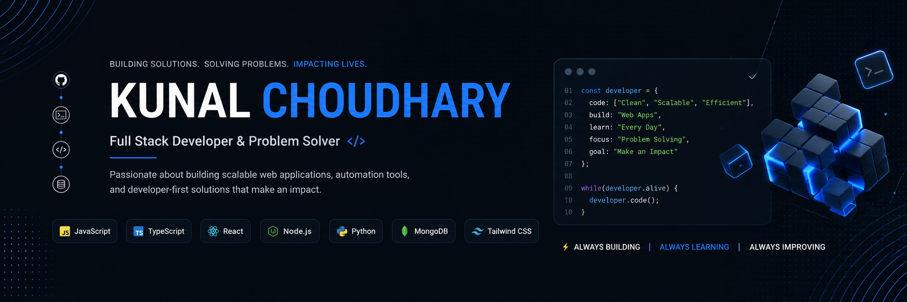

  

  

---

## 💫 Profile Overview

<table>
  <tr>
    <td width="65%" valign="top">
      <h3>About Me</h3>
      
I am a results-driven Full-Stack & Systems Developer specializing in low-latency desktop applications, cloud infrastructure automation, and security tools. With professional experience building production-grade software, I bridge the gap between robust backend services and seamless user interfaces.

      
My focus is on designing performant architectures, optimizing application loading speeds, and automating complex workflows to resolve real-world developer and business bottlenecks.

    </td>
    <td width="35%" valign="top" align="center">
      
       
      <ul align="left">
        <li>💼 <b>Role:</b> Full-Stack Developer</li>
        <li>📍 <b>Location:</b> Jaipur, Rajasthan, India</li>
        <li>📧 <b>Email:</b> <a href="mailto:kunal.codes5@gmail.com">kunal.codes5@gmail.com</a></li>
      </ul>
    </td>
  </tr>
</table>

---

## 🛠️ What I Do (Services)

<table>
  <tr>
    <td width="50%" valign="top">
      <h4>💻 Full Stack Web Apps</h4>
      
End-to-end custom web applications built with React, Next.js, and Node.js.

    </td>
    <td width="50%" valign="top">
      <h4>🚀 SaaS Products</h4>
      
Scalable software-as-a-service platforms with user management, payments, and analytics.

    </td>
  </tr>
  <tr>
    <td valign="top">
      <h4>⚡ Business Automation</h4>
      
Custom scripts and tools to automate manual workflows and boost operational efficiency.

    </td>
    <td valign="top">
      <h4>📊 Admin Dashboards</h4>
      
Beautiful dashboards with analytics, reporting, user management, and control panels.

    </td>
  </tr>
  <tr>
    <td valign="top">
      <h4>📈 Performance Optimization</h4>
      
Optimizing load times, SEO structure, database queries, and general site speed.

    </td>
    <td valign="top">
      <h4>🔌 Custom APIs &amp; Integrations</h4>
      
Designing robust REST/GraphQL APIs and integrating third-party services.

    </td>
  </tr>
</table>

---

## 🚀 Tech Stack & Tools

### 💻 Frontend

  

### ⚙️ Backend & Databases

  

### 🛠️ Tools & DevOps

  

---

## 🏆 Featured Work

Here are some of the key open-source projects I've built and maintained:

* 📁 **[Smart File Management System](https://github.com/Kunal-CodeLab/Smart-File-Management-System)**: A C#/.NET desktop utility implementing the Win32 File I/O API to automate local directory indexing and organization, handling 10,000+ files with zero data loss.
* ⚙️ **[Automated DevOps Infrastructure](https://github.com/Kunal-CodeLab/devops-infrastructure-project)**: Infrastructure as Code (IaC) configurations using Terraform & Ansible to deploy high-availability, multi-AZ Nginx servers on AWS with integrated CloudWatch monitoring.
* 🔍 **[Windows Forensic Analysis Tool](https://github.com/Kunal-CodeLab/forensic_analysis_tool_complete)**: A PyQt5-based digital forensics application designed to extract and parse Windows registries and raw disk artifacts, processing file metadata 3x faster.
* 🔊 **[SonicBoard](https://github.com/Kunal-CodeLab/SonicBoard)**: A premium C#/.NET 8 WPF soundboard application featuring global hotkeys, audio routing, and low-latency playback.
* 🔄 **[GitAuto-Push](https://github.com/Kunal-CodeLab/GitAuto-Push)**: A lightweight Node.js daemon script designed to monitor workspace folders and automatically synchronize changes to Git repositories.

  
  

  
  

  

---

## 📊 GitHub Statistics

  
  

---

## ⚡ Quick Stats

* 🎓 **Currently focusing on:** System Architectures, Digital Forensics, and DevOps Automation.
* 💬 **Ask me about:** C#/.NET WPF, Node.js, Python scripting, AWS Cloud, and Security Auditing.
* 🚀 **Fun Fact:** I believe automation is the key to solving cognitive fatigue.

---

## 🤝 Connect With Me

  
  
  
  

  

---

  If you find my work valuable, feel free to follow my profile and star the repositories you like! Let's build something great.

